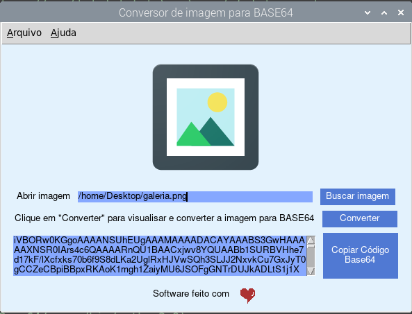

# CONVERSOR DE IMAGEM PARA BASE64

 

## O que este software faz?

**Conversor de Imagem para BASE64** codifica arquivos de imagens para que possam ser usados diretamente dentro de seus códigos, sem que haja necessidade de hospedar a imagem em um servidor.

Desta maneira ao invés de ter a *imagem.jpg* no servidor (ocupando espaço além de demorar para carregar em seu site) e usar o **código 1**, pode codificar a imagem para a BASE64 e jogá-la diretamente no seu código.

Imagens codificadas em BASE64 pode ser usadas diretamente dentro do html de sua página, por exemplo, usando o **código 2**:
 
* Código 1
 ~~~html

~~~

* Código 2
~~~html 

~~~

Em ambos os casos será a exibição de uma imagem na tela, mas no primeiro é necessário ter a imagem *heart.png* hospedada em um servidor, já no segundo a imagem está codificada neste amontoado de letras que só o computador entende.

## Como ter o CONVERSOR DE IMAGEM PARA BASE64 em seu computador

É necessário ter o python em sua máquina. Provavelmente você já tem ele. Se não tiver adquira-o gratuitamente no site oficial: [https://www.python.org/](https://www.python.org/)...

Clone este repositório com o comando:
 
~~~python

git clone https://github.com/elizeubarbosaabreu/Conversor-de-imagem-para-base64

~~~

Agora crie uma máquina virtual e instale as dependências do python. Passos para diferentes sistemas operacionais abaixo:

**No Linux e MAC:**
 
~~~python

cd Conversor-de-imagem-para-base64
python3 -m venv .venv
source .venv/bin/activate
pip install -r requirements.txt

~~~

**No Windows:**

~~~python

cd Conversor-de-imagem-para-base64
python -m venv .venv
source .venv\Scripts\activate.bat
pip install -r requirements.txt

~~~

Agora teste o **CONVERSOR DE IMAGEM PARA BASE64** com:
 
~~~python

python app.py

~~~

## Transforme o **CONVERSOR DE IMAGEM PARA BASE64** em executável:

Para uma melhor usabilidade, compile o arquivo app.py para executável com o comando abaixo:
 
~~~python

pyinstaller app.py

~~~

Agora basta copiar o executável que será gerado dentro da pasta dist/app para o local que quiser e criar um atalho no menu ou área de trabalho para facilitar o acesso ao **CONVERSOR DE IMAGEM PARA BASE64**

## Raspberry Pi

No Raspberry Pi, após transformar o app.py em executável com o passo acima, eu movo para a pasta */opt* com o comando abaixo e uso o alarcate para criar o menu:

~~~python

sudo mv dist/app /opt/Base64

~~~

No diretorio */home/<nome_do_usuario>/.local/share/aplication*, crio um arquivo chamado 'Conversor de Imagens para BASE64.desktop'

~~~python

[Desktop Entry]
Name=Conversor de Imagens para BASE64
Exec=/opt/Base64/app
Comment=biblia sagradaConversor de Imagens para BASE64
Terminal=false
Icon=/opt/Base64/tk/images/logo64.gif
Type=Application

~~~

##
